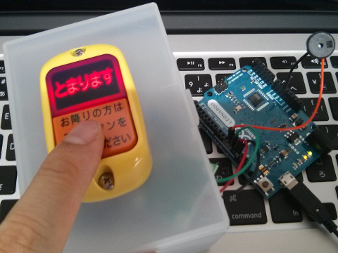
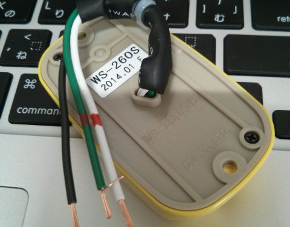
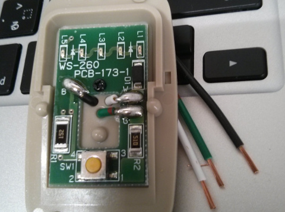

bus_button
========
降車ボタンとArduinoを使って光らせたり音を鳴らしたり。

* 
  * 図1  

降車ボタンは先日東急ハンズで開催されていたバスフェスで購入した。

* [バスの「次止まります」ボタンが売ってる！　バスフェス＠東急ハンズに行ってきた - ねとらぼ](http://nlab.itmedia.co.jp/nl/articles/1405/02/news103.html) (ねとらぼ)

降車ボタンの配線は白がLED, 緑がボタン、黒がGND。ボタンを押すと緑はGNDに接続される。その際の緑-黒の間には50Ωの抵抗が入っている。

* 
  * 図2 降車ボタン裏側

* 
  * 図3 降車ボタン中

バスで利用されている物なので、白に5V程度を入れただけでは降車ボタンに内蔵されているLEDは点灯しない。
そこでArduinoの5V出力を適当に12V以上に昇圧してLEDを点灯している。
昇圧は下記のキットを使用している。

* [昇圧型ＤＣ／ＤＣコンバータ５～２５Ｖ可変出力電源モジュール組立キット](http://akizukidenshi.com/catalog/g/gK-04377/) (秋月電子通商)
